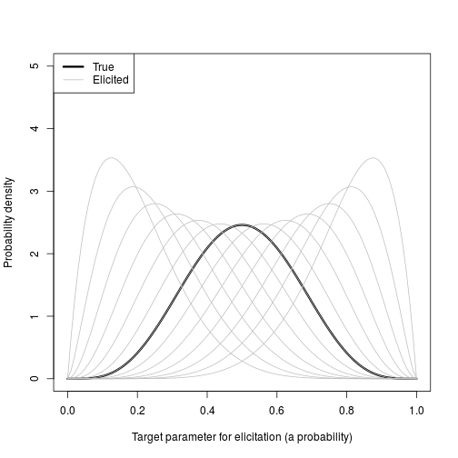
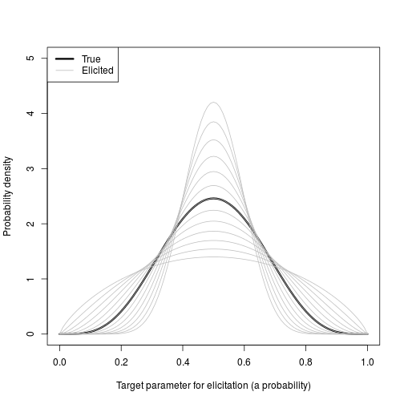
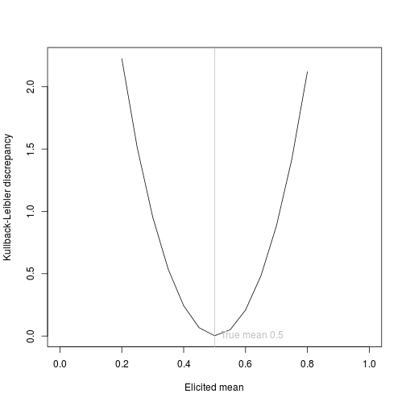
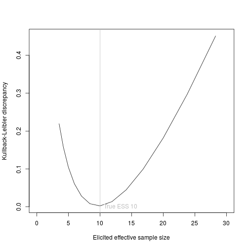
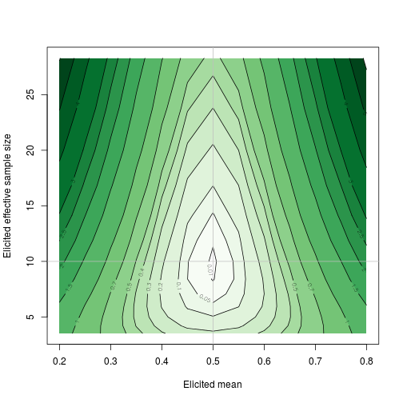

# Illustration of Kullback-Leibler

The Kullback-Leibler discrepancy of an approximation $p(x)$ to a distribution with true density function $q(x)$ is

\[ \int p(x)log(p(x)/q(x))dx = \int p(x)(log(p(x) - log(q(x))))dx \]

## R function to compute it

We wish to assess elicited approximations to a true posterior.  We will probably not know the true posterior analytically, but through an MCMC sample.

The following R function calculates the Kullback-Leibler discrepancy of an elicited distribution, given by a fitted `Beta(mu*ess, (1-mu)*ess)`, to a true distribution given by an MCMC sample `y`.  It uses a kernel density estimate of the true distribution, and numerical integration.


```r
kl <- function(y, mu, ess){
    d <- density(y, from=0, to=1)
    dfn <- with(d, approxfun(x = x, y = y))
    fn <- function(x){
        p <- dfn(x)
        q <- dbeta(x, mu*ess, (1-mu)*ess)
        p*(log(p) - log(q))
    }
    integrate(fn, 0, 1)
}
```

Suppose the true distribution is a Beta(a=5,b=5), equivalent to Beta(mn, (1-m)n) with mean m=0.5 and effective sample size (ESS) n=10


```r
a <- 5
b <- 5
m <- a/(a+b)
n <- a+b
y <- rbeta(10000, a, b)
```


We examine various elicited distributions which differ from the true distribution in two ways:

* bias (elicited mean - true mean), with elicited mean `mu.el` ranging from 0.2 to 0.8


```r
mu.el <- seq(0.2, 0.8, by=0.05)
x <- seq(0, 1, by=0.01)
plot(x, dbeta(x, a, b), type="l", lwd=3, ylim=c(0,5), xlab="Target parameter for elicitation (a probability)", ylab="Probability density")
for (i in seq(along=mu.el)){
    lines(x, dbeta(x, mu.el[i]*n, (1-mu.el[i])*n), col="gray")
}
legend("topleft",col=c("black","gray"), lwd=c(3,1), c("True", "Elicited"))
```



* excessive confidence (elicited ESS / true ESS), with elicited ESS `n.el` ranging from about 0.3 to 3 times the true ESS. 


```r
n.el <- 10*2^(seq(-6, 6, by=1)/4)
n.el
```

```
##  [1]  3.535534  4.204482  5.000000  5.946036  7.071068  8.408964 10.000000
##  [8] 11.892071 14.142136 16.817928 20.000000 23.784142 28.284271
```

```r
plot(x, dbeta(x, a, b), type="l", lwd=3, ylim=c(0,5), xlab="Target parameter for elicitation (a probability)", ylab="Probability density")
for (i in seq(along=n.el)){
    lines(x, dbeta(x, m*n.el[i], (1-m)*n.el[i]), col="gray")
}
legend("topleft",col=c("black","gray"), lwd=c(3,1), c("True", "Elicited"))
```



## Calculating Kullback-Leibler

The KL discrepancy from the true distribution is calculated for elicited distribution defined by each combination of bias and overconfidence values.


```r
kl.el <- matrix(nrow=length(mu.el), ncol=length(n.el))
for (i in seq(along=mu.el)){
    for (j in seq(along=n.el)){
        kl.el[i,j] <- kl(y, mu.el[i], n.el[j])$value
    }
}
```

## Relation of Kullback-Leibler to bias, given correct calibration 


```r
jtrue <- which(n.el==10)
plot(mu.el, kl.el[, jtrue], type="l", xlim=c(0,1), xlab="Elicited mean", ylab="Kullback-Leibler discrepancy")
abline(v=m, col="gray"); text(x=m, y=0, pos=4, "True mean 0.5", col="gray")
```



The KL between the biased distribution and the true distribution is symmetric with respect to the sign of bias, i.e. whether true posterior mean is overestimated / underestimated.

## Relation of Kullback-Leibler to calibration, given unbiased


```r
itrue <- which(mu.el==0.5)
plot(n.el, kl.el[itrue, ], type="l", xlim=c(0, 30), xlab="Elicited effective sample size", ylab="Kullback-Leibler discrepancy")
abline(v=n, col="gray"); text(x=n, y=0, pos=4, "True ESS 10", col="gray")
```



The KL has an asymmetric relationship with the level of confidence as measured by ESS.  Doesn't quite look symmetric on the log-scale either.  ESS of 20 (double the appropriate confidence) has a higher KL than an ESS of 5 (half confidence). 

### Relation of Kullback-Leibler to bias and calibration together

The contours in the plot below show bias and overconfidence combinations which are penalised equally by Kullback Leibler.

For example, given true mean 0.5 and true ESS 10:

* KL=0.1 results from
  - elicited mean 0.44, elicited ESS 10
  - elicited mean 0.5, elicited ESS 17

* KL=0.4 results from
  - elicted mean 0.35, elicited ESS 10
  - elicited mean 0.5, elicited ESS 27 


```r
library(RColorBrewer)
plot(mu.el, n.el, type="n", xlab="Elicited mean", ylab="Elicited effective sample size", )
levs <- c(0.01, 0.05, 0.1, 0.2, 0.3, 0.4, 0.5, 0.7, 1, 1.5, 2, 2.5, 3, 4, 5, 6)
getPalette = colorRampPalette(brewer.pal(9, "Greens"))
.filled.contour(x=mu.el, y=n.el, z=kl.el, levels=levs, col=getPalette(length(levs)-1))
contour(x=mu.el, y=n.el, z=kl.el, levels=levs, add=TRUE)
abline(h=10, v=0.5, col="gray")
```



